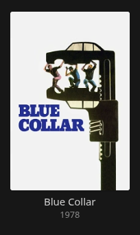
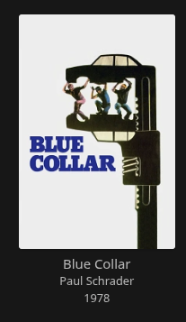

# Jellyfin Show Director

Adds a director line to library cards in Jellyfin Web:

```
Movie Title
Jane Smith
2024
```

Reads the director straight from Jellyfin's own metadata (the `People`
list on each item, filtered to `Type === "Director"`) — no scraping, no
external API calls. Only affects Jellyfin Web and clients built on it
(desktop browsers, desktop app, PWA) — native Android TV, Roku, tvOS,
Kodi, etc. are unaffected.

## Install

1. **Dashboard → Plugins → Repositories → +**, add:
   ```
   https://raw.githubusercontent.com/uglygus/jellyfin-plugin-show-director/main/manifest.json
   ```
2. Go to **Catalog**, find "Show Director", install it.
3. **Restart Jellyfin** (required — it patches `index.html` on startup).
4. **Plugins → Show Director** to set separator, max directors shown, and
   which item types get the line. Any change here needs another restart.
5. Hard-refresh Jellyfin Web (`Ctrl+Shift+R` / `Cmd+Shift+R`) to bypass
   the cached `index.html`.

Future updates then show up in **Plugins → My Plugins** like any other
catalog plugin.







### Manual install (no repository)

Build the DLL (see [Building](#building) below) and copy it to your
plugin directory, then restart:

```bash
mkdir -p /config/plugins/ShowDirector
cp bin/Release/net10.0/Jellyfin.Plugin.ShowDirector.dll /config/plugins/ShowDirector/
```

Docker installs: `/config/plugins/ShowDirector/`. Bare-metal:
`/var/lib/jellyfin/plugins/ShowDirector/`.

## Troubleshooting

- **Nothing shows up**: dev tools → Console →
  `localStorage.setItem('ShowDirectorDebug', '1')`, reload. Look for
  `[ShowDirector] initialized ...`. If nothing logs, view page source and
  search for `ShowDirector` to confirm the script tag was injected.
- **A title has no director**: it has no `Director` entry in its
  `People` metadata — check the item's details page in Jellyfin itself,
  and refresh metadata if needed.
- **Director line disappeared after a Jellyfin server update**: expected,
  the update replaced `index.html`. Restart Jellyfin once to re-patch it.
- **Restoring original index.html**: a one-time backup is saved next to
  it as `index.html.ShowDirector.bak`.

## Uninstall

Delete the plugin, or toggle **Enabled** off and restart once (cleanly
removes the injected script tag). If you deleted the DLL without
disabling first, restore `index.html` from the `.bak` file above.

---

## Development

### Building

Requires the [.NET 10 SDK](https://dotnet.microsoft.com/download) —
Jellyfin 12.1.x runs on .NET 10. Build anywhere with internet access,
then copy the DLL to the server.

```bash
cd Jellyfin.Plugin.ShowDirector
dotnet restore
dotnet build -c Release
```

Produces `bin/Release/net10.0/Jellyfin.Plugin.ShowDirector.dll`.

Pinned to `Jellyfin.Controller`/`Jellyfin.Model` `12.0.0`. If you target
a different server version, update `targetAbi` in `build.yaml` and the
`<PackageReference>` versions in the `.csproj` to match, then
`dotnet restore` again.

### How it works

- **C# server plugin**: serves the admin config page, and on every
  server startup patches `jellyfin-web/index.html` to add a `<script>`
  tag pointing at an embedded JS file it also serves. Re-patches on every
  start, so a Jellyfin update (which replaces `index.html`) just needs
  one restart to re-apply.
- **Client JS** (`Web/show-director.js`): uses a `MutationObserver` to
  catch cards as Jellyfin renders/recycles them, pulls `People` via the
  already-authenticated `ApiClient`, and inserts a centered line between
  title and year.

### Releasing a new version (maintainers)

Builds and publishes itself via GitHub Actions — no local SDK needed
unless developing.

1. Edit `owner:` in `build.yaml` if you've forked this (cosmetic only).
2. Commit to `main`.
3. Tag and push (`major.minor.patch` — the workflow expands it to
   Jellyfin's 4-part assembly version):
   ```bash
   git tag v1.1.0
   git push origin v1.1.0
   ```
4. `.github/workflows/release.yml` builds the DLL, packages it with
   [jprm](https://github.com/oddstr13/jellyfin-plugin-repository-manager),
   attaches it to a new GitHub Release, and commits the updated
   `manifest.json` back to `main`.
5. Jellyfin will then offer the new version as an update via the manifest
   URL above.

Note: the workflow pushes to `main` directly, so tag whatever commit is
currently the tip of `main`.
